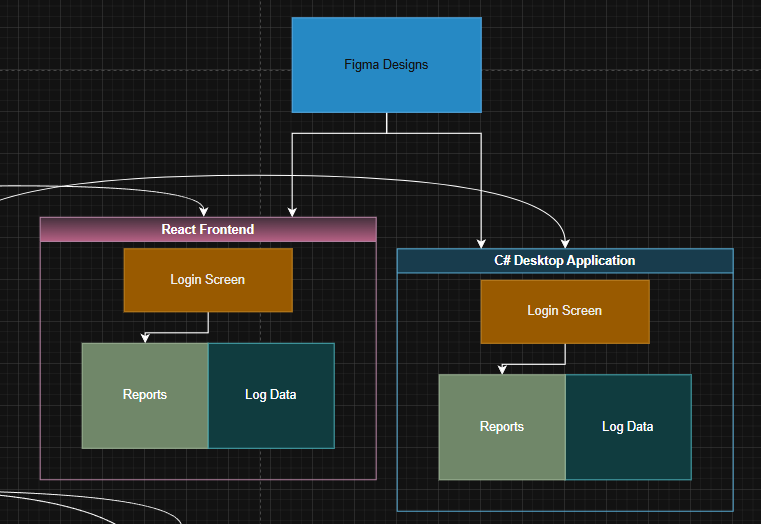
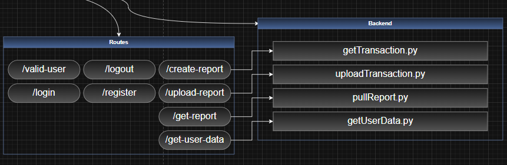
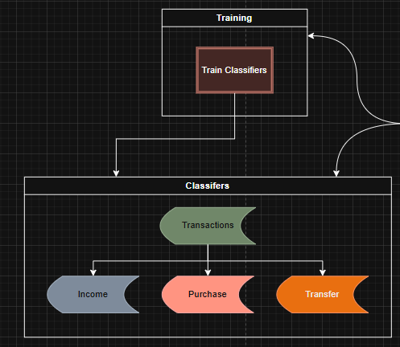

# Finianceable

Cross platform to manage and track financial information and spending habits 

## How it works
### Architecture
Financeable is a hosted service that you can access through either the website Financeable.cc or by downloading the windows desktop application. You can also self host this product as all of the source code and the database schema is open source. 

[View Full Diagram](https://viewer.diagrams.net/?tags=%7B%7D&lightbox=1&highlight=0000ff&edit=_blank&layers=1&nav=1&title=Financeable.drawio&dark=auto#R%3Cmxfile%3E%3Cdiagram%20name%3D%22Page-1%22%20id%3D%22VgFUhAksYnpfKsuqt2OZ%22%3E7V1pl5s60v41fU7yofsgsX%2FsdSZzk5lMd%2B4yn3KwkW0m2PgFnO7Orx%2BJzSBkkAEh2y%2B59yRGiK3qqUWlUulKvV%2B%2F%2FS10tqsvgYv8K6i4b1fqwxWEQIM2%2Foe0vGcthg7SlmXouVnbvuHF%2B4WyRiVr3Xkuiiod4yDwY29bbZwHmw2ax5U2JwyD12q3ReBXn7p1lqjW8DJ3%2FHrrn54br9JWS1f27X9H3nKVPxko2Zm1k3fOGqKV4wavpSb18Uq9D4MgTn%2Bt3%2B6RT6iX0yW97unA2eLFQrSJqw%2BK3%2FO394P5D0QuAFfqXXr2p%2BPv8rOg8Qnh4zy6%2FfTHbbCavcTaL%2BXxP3B7nfETuTWy7d8ja4qCXThHDfcCtfclt33JDoMwXgXLYOP4j%2FvWuzDYbdzkkxR8tO%2FzOQi22Xf%2BF8Xxe4YkZxcHuGkVr%2F3sLH7L8P0vcv2Nnh%2F%2BJ7tdcvDwVjl6z44y7DnhEsUN32QUnMUygYI1wvfA14XId2LvZ5VmTobNZdFvzw38I2PIEczJhWbizoFvMqVy5zAv9jTGWmKbkGYeByH%2BsNeVF6OXrZOw6hUr2Sq9Fp7v3wc%2B6YqvVg3XMg2NtAebOG%2F3iXq6dp3wxwfc5Sn5cwXvi98fcf8oDoMfqHQn9VbXVKbWuIKGj1%2F%2FzvV%2B4p%2FLOOmTNs1CugUTitFP%2BqW%2FRyg81Dn5XBTG6K3EozpmVmWtn6ve172JMPW0KbsLVKysT24JFVEwgwMqAUOGEuAUZnCAM%2BNIs8EjzS3S60Tb1GdZeG%2BEYLQ4I3VuKQolzrhdSf6wxPZOsXVlrxBLYvsnmkX4ZTrh26rDO28q4A2r8IaKMHyrA%2BLbvEAjJ1cugDqki3hW%2FJnvwp%2BUt93OLFXrya3k0tswdN5LHbaBt4mj0p2%2FkoaSvEKdkleNGm60XZAPdA5eYGmNF%2BAf6UsfuNwE1OUmpVBS0maXUaAt6Ngdx%2BYI%2Bh3MHIDgEO6aohiPt09Mve9tXDIKhsoDin7EWAQEWQCgjWYBjAE1DLjEcQ7oq1R6eqBDuqCSGOTPkmANkRNv7vi0ei8xUFGqLLxRNL2FjcnRVxR6mOAoPNa860NYDIbGVasCrInTuMtf2Bvdmrfbfz8%2F%2FaZ%2B%2Fyt8%2FOPT9ZB%2BnWSpBlVAtMGhznkmgaBUoeYKX%2FQ0iIZmGpY5SPwCaKqusQzi7ddPnUwgMOo2sGgrhkGUEVShMCOo8fAjDye5TuxEcRCio0NKM2duuSqLxFDVNN1lkfgBP23mRN0Gmwwy16hsV6msDxFMYYqc3k0nHRZfeY5GX5UkxtHoNHoBNjUY0bWGscVQ9gmOoABNw1AsZwgFqKnwQTdZ0vnlMz7OpuqEDAWATY3dVGMA%2BVxr362d%2FvLbH3fX9x74pzv%2FZG6v82BDr2mwjLE%2Fvcib5Zc0T74dsJCAQ1s0fka7X6PVPq6%2FimjVQkc4w2ICWqoMLbMP62cwNmlU1GIkedCffUFbyENX9RtFh4YKdNOyNepmBj2eFhwAAXmglR%2B9Jb%2Fj1Vv7zqaDu6EgFRnMEAeyFMtqdjeUl%2FkKrZ1Oes1kOB66TnseShUSVlOQI3veM9b4zmbpI%2BqBKsOf1I59nuPjAeTGidEdUQORCCDk2r2Mg2bEsIFATFquZ5Jw6crz3c%2FOe7AjN41iZ%2F4jP7pbBaH3C%2Fd3cpjg02GcqTBVqfR4IVdm9wxRhPt8zd8UUE1fnLdKx8%2FYKc7fJvB9Z5tbAHLhGsuXt7kL4jhYZ51asFxD5i6ZZ%2Bwy2NAZ4IA0OKpGFuhDQpHyuanYgCoDhwxr2gjYEgwx7eOaUtkEKS5LGihrcrDLtSGeF1qQy3K7d5s1rz3XTQxjhKHgbZafk24P2r7lOaMtaQrw5Qs%2FMaArfCHCd7jLbA9%2BN%2F0O%2F49f%2BJ7YTv2B%2BHX6Hdgf4%2F9J9xB7gxv8%2Bo6XfDrCwH1FBLx4iBAT%2FVeI1bEYxTSHyodP%2F%2Fz2sRNSWVqMRqaoMbDFcMknRPRGBNFaG2dNlMSHb49%2FiQPGEMMCNr8ZrssEjN7A2DpR9BqErnBg2MKAwYiaTcDoDQzsc3t%2BCRVpZhX%2Bjk2FhMb%2F7Ui2a3r76yi9%2Fy1hRxKY3HcopW5hz9%2B%2BqqR2pbet5naN8igxWAfCQsSWPjnuXTXdLpyvukawi9y%2BMtcB5bxT6YDQunTvnZEw14jaSfNK8t7p4K0w9cRIsZkQMYj3%2Fl08LMT57tYECwGwcJ04GdA93H57FAYKcX47Y55nAkVvUMwxKJZBwmlO132eEot40uFy5nxQkolIhfrnY%2FIwhTiO1wtn7fnv6SXrYBNkvnhxPkp8Q3JW2b6l7TWnfRNkH8Py23V6%2FaGOgUVak7V1xVEOND2BGm55IL%2BJ860TsugYn219QdE3B2Kn28DDtyk9IaV9cSZBMT6q4JicTWBLTuyxXGlO8UyaEkSTpiqmyakM1cn9S7gmp7Rya4rtfXOBb9KUIZy053Nr6dvrd8lfCY0SbOOj5Kvuk3ZAtyd%2F1ZBPblZgn5zfo5%2BcUpK2kgSQxgQ2pD2RAtICksM9mVNpKMicjWT1vUDoiUhkNNgwWJMisnh4hlt8fJuyOETFI%2Fddk6Nl6Tf5i0yk5cf%2B%2FtxT%2FuDKBaf4UhlJU7tSB3UhFnsLoxc2puiu7mUpszX7O4HSufIT9FL7%2B75dK%2Fd3ov2JZekFaKlNDgvRLTdWFUrWr6Z5xEYP6LR4YdGD3JZPJndQk5vpG%2BXD8%2BPtZ2GOWDF%2FODwsuGfhJlgcM47fLILhw%2Bo0KixhqOCdiZtCjXXOz4P1gIFGOkuACjRqFx5ntHmn%2FnLITvrpwrMEbN45vwkRpxBnHCtHwOadHZtgIT%2FOOFZ%2BgM07SzWBYoozTnHGKc44xRmnOONFxhlHy1KyedMAJpN7AnFGGhbi4oy8aQATLOTHGWlUCIszAoWn9ktL5LFtkWW%2B0OQ0VmqrqnrVoZpIEgy9JRVwccPjc4r0pPHJIzTPrnT3XX6hMPgW%2FCvpiE%2BUuqXkaF2naQ%2ByGLy%2BLlJtHvyJXgepmP%2FfINdevoYLNlwQ5MSWJbd0q2JNGJCOAaBIrWxo8%2BagTXNctNeBPZlNtOi4FrZLOr0OL3yaq6gz3%2B4f11fnT%2F7xJebTZ%2BpxgsSZTHSNlVAPFDjh4mxmusbKqAcKd6LEhIppqmua6pqmuqaprmmq6xKnukZLqQcKdyraZHPlz3WNllMPFO5ctAkX0ie7RkuqB6waz8IrMLoOshZz3L4MHddDlY2HTOQYSKmhjVTunltotmAx4TnYxSjqRH1W5E%2FLR0RF0U2KH%2FqwJRnpbS5aHzdG8A%2FwpimCxoKx4GhwLHTyHxMAyR%2BiYMJ5Fp%2FWFYaCITuQMLE1S%2F5jIah1BEUNemA%2B6qkPbJ7mIcKsuQ4R0TtDOhYaQ1Po8Ka6C5yq0uARpjp4s2omhFAI2W39wHFPBSFA3C46gDfDRhhEuIBwGEedIEKQ0BciSxTX8ZHeeHR8iFMhBm%2BAcFIhFD78YEmmb8fWHcUWaSNgg3cgO2GDwga%2Brede76ob0I6Ej7GcD2NyPjqiI0RLL4plYMMcDRzS3Y5zBQc2K95GOjJEeqSMMNjZxTvunPkPtHE7MYQV8NDpBf0mtfmR1pQ5cHzAo7YHRevzxoh4QH5ntF53ZDStMbDS6D1WwQOVbyT1zpnHXrC52b4LHq9oOjVaKZSJcLMC%2BT3SCSAFQNJgx2lhRKCBgfwVsSeQFCDZ7nz%2FOQl3nAI6BKqQEfZvO6vdpjttaC9772meBWJ9mWjI4CIvA2Df3fJ6MoBnuVRfBpgnzQDJEsCzVqkvA6yTZkDfHdL7MUCVsXEiMlzFRSwPw7YNYOls78HVTdVm7uH8jLBDiJueQmzlO49nGdvYqfR4VqX2zC4GoAONZ1ufR3sUY4xn9e6LSlXeBYUFIc%2FD2%2BCVbg1Kle6cqEcw6tBmvUeOIRRHVei9ocnGqMkfluTfPZjpmZp0f05DicrLPEQkv7iDbDO2SwXUOjlqUZ64lU8pJCTwxHAt09BYtFdvdU0FdW4tkj%2BdxmulhQKlLcHD5ewDJKMmskyg%2FONj%2Buvw%2BY%2FM0V460ouGHOcVI%2FoGtUwrZXFJuBp3KHFgsHTZ2xgLKm4gOxwLo3whteJJr8pIaJwB110w9SNQsPeDWGTH36cSuqPoB4m8QOV2u%2FW9uUNCZOI8IYNSmMXUy0CekNH2PDqVdQxPSOPOZVSb5gMncewwFcsT8GrhRbsTKmWsLtoJ1S25Tih3hsXAQjM5oS2QkMCTyQk9PydUFR8llRKkLuldzTLLmvdauVEU2KJ%2BmaXMkD9Llhjlc2JdZybUvoHx5NLbMHTeSx3ydbkHy5cBKmU3R9kT7wX5iqODF2h52Wr2BfhH%2BtIHLi%2Fq1%2BQvSE%2FADldhbfkLzaKtebv99%2FPTb%2Br3v8LHPz5dMxzA4QcFNU137ztR5C1QOODaJGqxENColEutyaHnVShMGgKeoH8T9cvqhNlPSsR%2FODeOTTVjJC%2BO%2FXR74lkHnvWtBNhNi9OuQYtOVu3G%2FlWVPJQizd2VCVDHAMo%2BBzzJgBNjPNMInpJZXjlb8tN1YuclDkJnyRW2e0NuBoKmUc6hsczh0U%2FN9pcS3rpZf82qGf8iuazImzap1KWmec1ehoRRmFImozTTSFx%2FfkYBTdU1FqM%2Bdd8cjcmiqn9G%2B9lDxAYabNbJcGjhGFYSkuEO4tybqs4O4nzrU9qTh0fjMYkxDpHIJKQDjcWkw2J0B5UDkbav2KyvnEiYIAF6IkEYkwYNm7CdKMkujnWUj8MMmLRERw6DWtZIKF9qLJKtcqchQIWpN7CtvHYXFqZCN7YnCwyr6uaYzZ4s0CmNfmz%2Fa3hUeAsY1O4U1%2FQsp%2BDwFmQY%2FxHiW99IQSVvs%2Byk8wFraSBVeQfo1KBkkNU9bBLyDkUYUp7b5rRMlhvs9pXNe02EOa7tMld0OEgDKjzIEtyUhR69rrFH1qyXUmWONvy6KzbBeWJY52yQx1DccKzNLdD97svi1%2B%2Fq32a2tnz4%2Bz%2BQ%2FttLTl%2BRHJQdNoIi4kZ9PaZhrK0GjzSf1AW9Q0dMaEBGSKKejOwH8x%2BUrJS0pZ85hT%2B9fDeK4iZPB96FPe9nMaxH41uzDXB56w3mKKuTLi%2BMaHnJt06Ngel5JKA0zUy3ZIYxTDv9PDoyYslY8m3COtuaGVzmW2KV%2F8w%2BEVY1Q%2B4SrN%2BWpNLsDSlhicfHYXyDv2rt4e8itpzpENSY%2FrwbLnNFaR5Vi8tGMLlz8KSSGsW7UBy1j1iF0pPa3AnIw1HbRXOsRoMNL62TMkW%2FRx3jesxcmxZ0C0y2MTUOF6eFA615jrm6Oo%2B5MWbcqO74NAF4BH%2F1wOO7r506gp313H%2BJw4723dj6sHOs2N%2BBx2de1zzYbIjLQvl6HFw12bG9z84M%2BVX65tWv5%2FiOhE6H618nG6OVak9Xy1o%2FsHTmJuBWlkzSZpeQRLlid5Y8ZsW%2Fa%2BY7k13BYhEhMftjWtx8kmfOwsR1%2BPa%2B7TYFwmPPastKxdmzfKfIS1aAyogK0OobOO%2FJTthXAR7YOnRsBfh%2BRJ33Fg2I3SmVW%2BWNoeT6%2BOwl%2BrtOtGqMONdV127zj6jjqjPGorM2tSVwHzprDDc8t0bn4YZzayi5Hncec%2ByhoepLXmRoqP8eI0ltTpplwJNSUX2COL1UFAZvEkOO7t4fvHk8lqpSxZUCs8YYYlqSPSxBqkrKvAidb52njfHmZ1P9e8%2BKsGljn0VI%2B%2FekKCRue872OBATcKXFWRMXcbVH8TxkL7gbLwCY4liaO2LzzlAfN6G3Dn46peSQkneRJovsNyNLzCTyUfkYuV75sJjbTJICKn4Tc7azk5RpDDGrVZWwqEC71bRhWe%2B5Q2jVlioA6nkjTB5CpbsBz9HVLvH2WUk8t3DLLW1gc7uxdj3qcYwbS5tMd%2BHeJCqhJpthxzne9u3kauVthZUngApPjm1viZBc7OO4oCG3RPRdItaTc5n30nn0XfD%2BUkbfZIYkL6XMnu%2BQOxS3ucuzMHTY5UyJwFrxbluci89dfaWn2agREisPUhBq5kToX7t4uxsu%2FkGvKKSTwMTZCn0MW1F3zs%2Ffe8pqZ8jznhiJl%2BOIQapPRE5V4GEnpU9gvk2DABHgDm0L0Cf3eHC0DEKv477JnWip0sO0AWl5vPYQ7dLnuYR9YlwM996u7Z5lGzeQXgYujtBwDL0tO5t%2FxDjXWAszDrCTZy%2BLnuwsFN2JsLNx0HYN9J4szXSRNJbqvHsDSFmLwNBoRVsRtaeWUzbajd7hRFWlopeahGr9EHSOnRQMbxdEcFqCOJA%2FDOTKG%2BCOkej1GEnHkXgUByFyv5NiELw%2B32zn%2Be6XwEV%2BJ8HlWRBKiZEwHwQcLxoDOc7zEGE1cP85X1zbTQceTUpxK0WKCJ9YvcNOzTl3vSN1D6CCqMKl4BRmMaBKrTYXNirnKnPZWyDqez9egkBIXeUBc5f0ojknZPrpuBkSATLHu2nq4AadbDzau1Qfy6BTY5paZF3Y0g3IVfO1txic8v6UMC%2BGR41W5eGbN%2BFgcHwvMc23MgBeq%2FA9oJ7vnGp3DMAvMc0Ayt24FbKKVI40cMumO34hKcLQlA%2FXUxikjYU3Qbh2fEzRznsV8STk06l%2B4uwm5F1%2FNbwTEiJX5KIGuoiaODSqY0QT4GW64HIngtTszt0zwHLeX0oGGFkiagN4mOCjJ30VyB8z1HySSV9UXsEQe54coHjn%2BdEz8jXHm%2B6GcvdNh6xCqePYePG5S7X1ZrawGCmrWKrs0HOebdPbv%2BfY4L02YyzQvx8jmiO5cvXYCRpQ6vITqHeuMF9kbLRmUEF2Ov54HFUUqr6UomldDEuXbfgy5MtjMM8UUl8GS55SrTK3b83ipoWx8tjIo3r7svGsJgI7cdEea26pYceCE82GM2Hd19CoGvg25Wtcq00rXHpnwwHFpJ4HxS6uZXONd1c5RtBBjH%2F5UmodOrkB0AG6AbxJNrV4PA9eOp%2BwnqqrJvZHaT01ExUBKnJVquyky12lVkHYZiBq531aL5PJUorF1Mqbt9SKMZq6X7XurnyjQEs3gZb%2BbUqFH4%2FX1Ay%2Fts0ecutwWTjtGxkbA6dFzOn8capB8Tg987RXNt3GWn3aSFLRjmHN%2F%2Fu6S15um21ziEVKWYTBGv%2FzkHcefgUlXb9%2BiJwaNlN5VmP3FIazGumOJQydlDathUGL1q7tQtuktgfzAxhzlWNKqpfs6zuKnOqjiSnPIrGeYnrmBadOSExpp%2F40xZR3S2JBYhpnmzuPIqiqiPomTGpxxY77SapWZ8gFSKrUTYJzko4uDPfBeuZtUGK2MMXpWWz8NcrXvedJDj%2Fl5u0%2B773outenyRAcOiqsU1VRhAlOrjNFCs5Fmrix0gcbSTq64OT73a7JwmZxpWyogdgghWzY8OfZd6Un%2FE8r2WMg%2BI81VdxI0vHhj6J4dPQPUl2I7TWJj8lpkksLVfMmjk8eZ9NN6hR7nmfGkzreyPbL2VtIMfIcoLETxxtB30U%2F5VPk4Qr7qLuoyo9WjbUtpXNldyhleNV58CXTZIozC34SfzjazecoIi3xCvN0Ffgd88pZaZ26QXm5sKrohqglymYIo4ai3PyGx43bia4c2Q1V66EPUcuErUZGGr0dkTTiJBjeoFeiHv28akw3S83I3QGKcWOYFWqrOm4y7P0fo0J9Y4jq3w02SIIP9EB2SSBkDnx3ADLzhJGowJ4ujqji52X005pMb879hkcsQGnQEdI8JZ7VRGft34rZVLjBhkpjZUbn7k4vOwp1xjsKw%2FyTBPu8%2BDAMgrjcndjhtLad%2Bvg%2F%3C%2Fdiagram%3E%3C%2Fmxfile%3E)

Click on  to toggle what layers are shown
* l1: Context
* l2: Containers
* l3: Components

## Areas
* [Website](#website)
* [Windows Desktop](#windows-desktop)
* [API](#api)
* [ML Model](#ML-Model)
* [Database](#database)

## Frontend
### Website
#### Overview 
Built in React - the frontend website is hosted on an aws ec2 instance (same ec2 as the API). 

### Windows Desktop
#### Overview
The binary executable allows for a local application user experience for windows. It is built in C# with the WinForm framework.

### Diagram

## API
### Overview
Flask API that handles business logic for both frontend environments.

### Diagram

## ML Model
### Overview
Machine learning environment for creating and testing TFID classification models using rhe Python package sklearn.

### Diagram

## Database
### Overview

### Diagram

